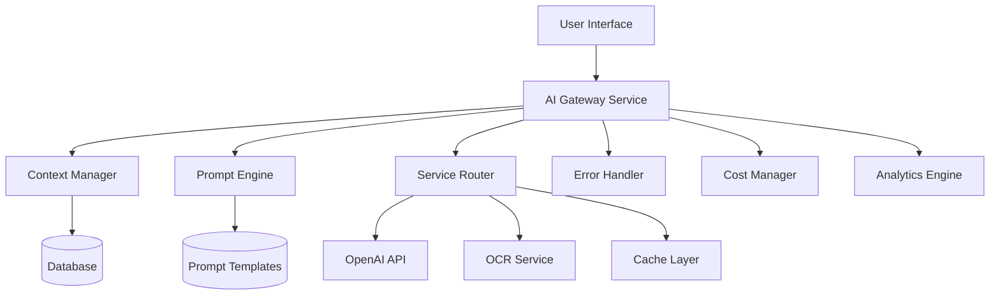
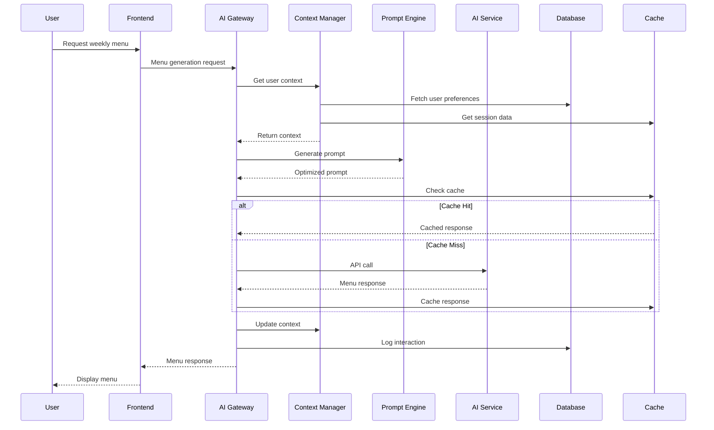
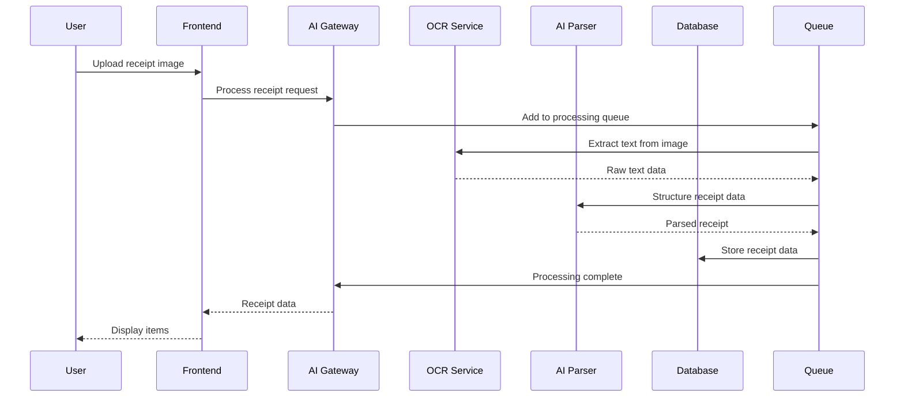

# AI Integration Architecture for Meal Planning Application

## Executive Summary

This document outlines the AI integration architecture for a dynamic meal planning application that leverages multiple AI services for menu generation, receipt processing, and predictive analytics. The architecture prioritizes cost efficiency, data privacy, and scalable performance while maintaining conversational context across user interactions.

## Table of Contents

1. [Architecture Overview](#architecture-overview)
2. [AI Service Integration](#ai-service-integration)
3. [Use Case Implementations](#use-case-implementations)
4. [Context Management](#context-management)
5. [Error Handling & Fallbacks](#error-handling--fallbacks)
6. [Cost Optimization](#cost-optimization)
7. [Data Flow Architecture](#data-flow-architecture)
8. [Privacy & Security](#privacy--security)
9. [Performance Optimization](#performance-optimization)
10. [Implementation Roadmap](#implementation-roadmap)

---

## Architecture Overview

### Core Components



### Technology Stack

- **Primary AI Provider**: OpenAI (GPT-4/GPT-3.5-turbo)
- **OCR Services**: Google Cloud Vision API / Azure Computer Vision
- **Caching**: Redis for session context and API response caching
- **Queue System**: Bull/BullMQ for batch processing
- **Monitoring**: Custom analytics + external monitoring (DataDog/NewRelic)

---

## AI Service Integration

### Service Architecture

```typescript
interface AIServiceProvider {
  name: string;
  endpoint: string;
  apiKey: string;
  rateLimit: RateLimit;
  costPerToken: CostStructure;
  capabilities: ServiceCapability[];
}

interface ServiceCapability {
  type: 'text-generation' | 'image-analysis' | 'embedding' | 'moderation';
  maxTokens: number;
  supportedFormats?: string[];
}

class AIGateway {
  private providers: Map<string, AIServiceProvider>;
  private router: ServiceRouter;
  private contextManager: ContextManager;
  private costManager: CostManager;

  async processRequest(request: AIRequest): Promise<AIResponse> {
    // Route to appropriate service based on request type and cost constraints
    const service = await this.router.selectOptimalService(request);
    const context = await this.contextManager.getContext(request.sessionId);
    
    try {
      const response = await this.callService(service, request, context);
      await this.costManager.trackUsage(service, request, response);
      await this.contextManager.updateContext(request.sessionId, response);
      return response;
    } catch (error) {
      return await this.handleError(error, request);
    }
  }
}
```

### Service Selection Strategy

```typescript
class ServiceRouter {
  async selectOptimalService(request: AIRequest): Promise<AIServiceProvider> {
    const factors = {
      cost: this.calculateCostScore(request),
      latency: this.getLatencyRequirements(request),
      quality: this.getQualityRequirements(request),
      availability: await this.checkServiceHealth()
    };

    // Priority matrix for different request types
    const priorities = {
      'menu-generation': { quality: 0.6, cost: 0.3, latency: 0.1 },
      'menu-alternatives': { latency: 0.5, quality: 0.4, cost: 0.1 },
      'receipt-ocr': { quality: 0.7, latency: 0.2, cost: 0.1 },
      'menu-parsing': { quality: 0.5, cost: 0.4, latency: 0.1 }
    };

    return this.selectBestMatch(factors, priorities[request.type]);
  }
}
```

---

## Use Case Implementations

### 1. Menu Generation

#### Prompt Template Strategy

```typescript
interface MenuGenerationPrompt {
  systemPrompt: string;
  userPrompt: string;
  constraints: MenuConstraints;
  context: ConversationContext;
}

class MenuPromptEngine {
  generateMenuPrompt(constraints: MenuConstraints, context?: ConversationContext): MenuGenerationPrompt {
    const systemPrompt = `
You are a professional meal planner specializing in creating diverse, balanced weekly menus.

CORE PRINCIPLES:
- Create exactly 7 meals (6 dinners + 1 special breakfast)
- Ensure nutritional balance and variety
- Consider cooking complexity distribution
- Optimize for stated budget and family size
- Respect dietary restrictions absolutely

OUTPUT FORMAT:
Return a JSON object with this exact structure:
{
  "weeklyMenu": {
    "meals": [
      {
        "day": "Monday",
        "mealType": "dinner",
        "name": "Meal Name",
        "cuisine": "Italian",
        "complexity": "medium",
        "estimatedCost": 25.50,
        "prepTime": 45,
        "servings": 4,
        "ingredients": ["ingredient1", "ingredient2"],
        "dietaryTags": ["vegetarian", "gluten-free"],
        "description": "Brief description"
      }
    ],
    "totalEstimatedCost": 180.00,
    "varietyScore": 0.85,
    "nutritionBalance": {
      "vegetables": 0.8,
      "protein": 0.7,
      "grains": 0.6
    }
  }
}`;

    const userPrompt = this.buildUserPrompt(constraints, context);
    
    return {
      systemPrompt,
      userPrompt,
      constraints,
      context: context || {}
    };
  }

  private buildUserPrompt(constraints: MenuConstraints, context?: ConversationContext): string {
    let prompt = `Create a weekly menu with these requirements:\n`;
    
    // Core requirements
    prompt += `- Family size: ${constraints.familySize}\n`;
    prompt += `- Budget: $${constraints.budget} for the week\n`;
    prompt += `- Location: ${constraints.location} (affects ingredient availability/pricing)\n`;
    
    // Dietary preferences
    if (constraints.dietary.length > 0) {
      prompt += `- Dietary restrictions: ${constraints.dietary.join(', ')}\n`;
    }
    
    // Complexity preferences
    if (constraints.complexityPreference) {
      prompt += `- Cooking complexity: ${constraints.complexityPreference}\n`;
    }
    
    // Historical context
    if (context?.previousMenus) {
      prompt += `\nPREVIOUS CONTEXT:\n`;
      prompt += `- Last week's proteins: ${context.previousMenus.lastWeekProteins.join(', ')}\n`;
      prompt += `- Recently used cuisines: ${context.previousMenus.recentCuisines.join(', ')}\n`;
      prompt += `- User feedback: ${context.userFeedback || 'None'}\n`;
    }
    
    // Specific requests
    if (constraints.specificRequests) {
      prompt += `\nSPECIAL REQUESTS:\n${constraints.specificRequests}\n`;
    }
    
    prompt += `\nEnsure variety in cuisines, cooking methods, and ingredients. Aim for a rainbow of colors across the week.`;
    
    return prompt;
  }
}
```

### 2. Menu Alternatives Generation

```typescript
class MenuAlternativeEngine {
  async generateAlternatives(
    originalMenu: WeeklyMenu, 
    rejectedMeals: string[], 
    userFeedback: string,
    constraints: MenuConstraints
  ): Promise<MenuAlternative[]> {
    
    const prompt = `
CONTEXT: User rejected specific meals from their weekly menu and provided feedback.

ORIGINAL MENU:
${JSON.stringify(originalMenu, null, 2)}

REJECTED MEALS: ${rejectedMeals.join(', ')}
USER FEEDBACK: "${userFeedback}"

TASK: Generate 3 alternative meals for each rejected meal that:
1. Address the specific feedback provided
2. Maintain budget constraints
3. Don't duplicate existing approved meals
4. Match complexity and cuisine diversity goals

Return alternatives in this format:
{
  "alternatives": {
    "rejectedMealName": [
      {
        "name": "Alternative Meal Name",
        "reason": "Why this addresses user feedback",
        "changes": ["specific changes made"],
        // ... full meal object
      }
    ]
  }
}`;

    return await this.aiGateway.processRequest({
      type: 'menu-alternatives',
      prompt,
      temperature: 0.8, // Higher creativity for alternatives
      maxTokens: 2000
    });
  }
}
```

### 3. Receipt OCR Processing

```typescript
interface ReceiptOCRProcessor {
  processReceipt(imageData: Buffer, options: OCROptions): Promise<ReceiptData>;
}

class ReceiptAIProcessor implements ReceiptOCRProcessor {
  async processReceipt(imageData: Buffer, options: OCROptions): Promise<ReceiptData> {
    // Step 1: OCR extraction
    const ocrResult = await this.ocrService.extractText(imageData);
    
    // Step 2: AI-powered parsing and structuring
    const structurePrompt = `
Extract structured grocery data from this receipt text:

TEXT:
${ocrResult.text}

Return JSON with this structure:
{
  "store": "Store Name",
  "date": "YYYY-MM-DD",
  "items": [
    {
      "name": "standardized item name",
      "originalName": "exact name from receipt",
      "quantity": 1,
      "unit": "each|lb|oz|etc",
      "unitPrice": 2.99,
      "totalPrice": 2.99,
      "category": "produce|dairy|meat|etc",
      "confidence": 0.95
    }
  ],
  "subtotal": 45.67,
  "tax": 3.25,
  "total": 48.92,
  "confidence": 0.92
}

RULES:
- Standardize product names (e.g., "Bananas Organic" → "Organic Bananas")
- Categorize items using standard grocery categories
- Include confidence scores for each item
- Handle quantity/weight parsing carefully
- Ignore non-food items unless specified
`;

    const aiResponse = await this.aiGateway.processRequest({
      type: 'receipt-parsing',
      prompt: structurePrompt,
      temperature: 0.1, // Low temperature for accuracy
      maxTokens: 2000
    });

    return this.validateAndCleanReceiptData(aiResponse.data);
  }
}
```

### 4. Raw Menu Import Processing

```typescript
class MenuImportProcessor {
  async parseRawMenu(rawText: string, context: ImportContext): Promise<StructuredMenu> {
    const prompt = `
Parse this unstructured menu text into a standardized format:

RAW TEXT:
${rawText}

CONTEXT:
- Source: ${context.source} (restaurant/website/pdf/etc)
- Cuisine type: ${context.cuisineHint || 'unknown'}
- Price range: ${context.priceRange || 'unknown'}

Extract menu items with this structure:
{
  "restaurant": "Restaurant Name",
  "menuType": "lunch|dinner|breakfast|etc",
  "items": [
    {
      "name": "Dish Name",
      "description": "Dish description",
      "price": 15.99,
      "category": "appetizer|entree|dessert|beverage",
      "dietaryInfo": ["vegetarian", "gluten-free", "spicy"],
      "ingredients": ["ingredient1", "ingredient2"],
      "allergens": ["nuts", "dairy"],
      "estimatedCalories": 650,
      "confidence": 0.9
    }
  ],
  "lastUpdated": "2026-01-28",
  "confidence": 0.85
}

PARSING RULES:
- Extract prices in decimal format
- Identify dietary restrictions from descriptions
- Infer ingredients from dish descriptions
- Categorize items appropriately
- Handle multiple price formats
- Include confidence scores
`;

    return await this.aiGateway.processRequest({
      type: 'menu-parsing',
      prompt,
      temperature: 0.2,
      maxTokens: 3000
    });
  }
}
```

### 5. Historical Context & Predictive Analytics

```typescript
class PreferenceEngine {
  async generatePersonalizedRecommendations(
    userId: string, 
    menuHistory: MenuHistory[],
    userRatings: UserRating[]
  ): Promise<PersonalizedRecommendations> {
    
    const analysisPrompt = `
Analyze user meal preferences and generate personalized recommendations:

USER HISTORY (last 12 weeks):
${JSON.stringify(menuHistory.slice(-12), null, 2)}

USER RATINGS:
${JSON.stringify(userRatings, null, 2)}

ANALYSIS TASKS:
1. Identify preferred cuisines, ingredients, and cooking styles
2. Detect patterns in rejected/low-rated meals
3. Calculate preference scores for different attributes
4. Generate specific recommendations for future menus

Return analysis in this format:
{
  "preferences": {
    "cuisines": {"italian": 0.8, "mexican": 0.6, "asian": 0.7},
    "ingredients": {"chicken": 0.9, "pasta": 0.8, "seafood": 0.3},
    "complexity": {"simple": 0.7, "medium": 0.8, "complex": 0.2},
    "cookingMethods": {"roasted": 0.8, "fried": 0.4, "grilled": 0.9}
  },
  "avoidances": {
    "ingredients": ["mushrooms", "liver"],
    "cuisines": ["indian"],
    "reasons": ["consistently low ratings", "explicitly rejected"]
  },
  "recommendations": {
    "nextWeek": [
      "Try Mediterranean flavors - high rating trend",
      "Include more grilled proteins",
      "Avoid complex sauces on weeknights"
    ],
    "seasonal": ["Spring vegetables coming into season"],
    "budget": ["Protein rotation saves 15% weekly"]
  },
  "confidence": 0.85
}`;

    return await this.aiGateway.processRequest({
      type: 'preference-analysis',
      prompt: analysisPrompt,
      temperature: 0.3,
      maxTokens: 2500
    });
  }
}
```

---

## Context Management

### Session Context Architecture

```typescript
interface ConversationContext {
  sessionId: string;
  userId: string;
  startTime: Date;
  lastActivity: Date;
  conversationHistory: Message[];
  currentMenu?: WeeklyMenu;
  pendingActions: PendingAction[];
  preferences: UserPreferences;
  constraints: MenuConstraints;
  metadata: ContextMetadata;
}

class ContextManager {
  private redis: Redis;
  private database: Database;
  
  async initializeSession(userId: string): Promise<string> {
    const sessionId = this.generateSessionId();
    const userPreferences = await this.database.getUserPreferences(userId);
    
    const context: ConversationContext = {
      sessionId,
      userId,
      startTime: new Date(),
      lastActivity: new Date(),
      conversationHistory: [],
      pendingActions: [],
      preferences: userPreferences,
      constraints: this.getDefaultConstraints(userPreferences),
      metadata: { version: '1.0', features: ['menu-generation', 'alternatives'] }
    };
    
    await this.redis.setex(
      `context:${sessionId}`, 
      this.SESSION_TIMEOUT, 
      JSON.stringify(context)
    );
    
    return sessionId;
  }

  async updateContext(sessionId: string, update: ContextUpdate): Promise<void> {
    const context = await this.getContext(sessionId);
    if (!context) throw new Error('Session not found');

    // Apply updates
    context.lastActivity = new Date();
    context.conversationHistory.push(update.message);
    
    if (update.menuUpdate) {
      context.currentMenu = { ...context.currentMenu, ...update.menuUpdate };
    }
    
    if (update.constraintUpdate) {
      context.constraints = { ...context.constraints, ...update.constraintUpdate };
    }

    // Trim conversation history if too long
    if (context.conversationHistory.length > this.MAX_HISTORY_LENGTH) {
      context.conversationHistory = context.conversationHistory.slice(-this.MAX_HISTORY_LENGTH);
    }

    await this.redis.setex(
      `context:${sessionId}`, 
      this.SESSION_TIMEOUT, 
      JSON.stringify(context)
    );

    // Persist important updates to database
    if (update.shouldPersist) {
      await this.persistContextUpdate(sessionId, update);
    }
  }

  async getContext(sessionId: string): Promise<ConversationContext | null> {
    const cached = await this.redis.get(`context:${sessionId}`);
    if (cached) {
      return JSON.parse(cached);
    }

    // Try to restore from database
    const restored = await this.restoreContextFromDatabase(sessionId);
    if (restored) {
      await this.redis.setex(
        `context:${sessionId}`, 
        this.SESSION_TIMEOUT, 
        JSON.stringify(restored)
      );
    }

    return restored;
  }
}
```

### Context Persistence Strategy

```typescript
class ContextPersistence {
  async saveUserPreferences(userId: string, preferences: UserPreferences): Promise<void> {
    await this.database.upsert('user_preferences', {
      user_id: userId,
      dietary_restrictions: preferences.dietary,
      cuisine_preferences: preferences.cuisines,
      complexity_preference: preferences.complexity,
      budget_range: preferences.budgetRange,
      family_size: preferences.familySize,
      updated_at: new Date()
    });
  }

  async saveMenuInteraction(sessionId: string, interaction: MenuInteraction): Promise<void> {
    await this.database.insert('menu_interactions', {
      session_id: sessionId,
      user_id: interaction.userId,
      interaction_type: interaction.type, // 'generate', 'approve', 'reject', 'modify'
      menu_data: JSON.stringify(interaction.menuData),
      user_feedback: interaction.feedback,
      timestamp: new Date()
    });
  }

  async getHistoricalContext(userId: string, weeks: number = 4): Promise<HistoricalContext> {
    const recentMenus = await this.database.query(`
      SELECT menu_data, user_feedback, created_at
      FROM menu_interactions 
      WHERE user_id = $1 
        AND interaction_type = 'approve'
        AND created_at > NOW() - INTERVAL '${weeks} weeks'
      ORDER BY created_at DESC
    `, [userId]);

    return {
      recentMenus: recentMenus.map(r => JSON.parse(r.menu_data)),
      feedbackPatterns: this.analyzeFeedbackPatterns(recentMenus),
      preferenceEvolution: this.calculatePreferenceEvolution(recentMenus)
    };
  }
}
```

---

## Error Handling & Fallbacks

### Multi-Tier Error Strategy

```typescript
class ErrorHandler {
  async handleError(error: AIError, request: AIRequest): Promise<AIResponse> {
    const strategy = this.getErrorStrategy(error);
    
    switch (strategy) {
      case 'RETRY':
        return await this.retryWithBackoff(request, error);
      
      case 'FALLBACK_SERVICE':
        return await this.tryFallbackService(request);
      
      case 'CACHED_RESPONSE':
        return await this.getCachedSimilarResponse(request);
      
      case 'SIMPLIFIED_REQUEST':
        return await this.simplifyAndRetry(request);
      
      case 'GRACEFUL_DEGRADATION':
        return await this.gracefulDegradation(request);
      
      default:
        throw new SystemError('All fallback strategies exhausted', error);
    }
  }

  private getErrorStrategy(error: AIError): ErrorStrategy {
    // Rate limiting
    if (error.type === 'RATE_LIMIT') {
      return error.retryAfter < 60 ? 'RETRY' : 'FALLBACK_SERVICE';
    }
    
    // Service unavailable
    if (error.type === 'SERVICE_UNAVAILABLE') {
      return 'FALLBACK_SERVICE';
    }
    
    // Token limit exceeded
    if (error.type === 'TOKEN_LIMIT_EXCEEDED') {
      return 'SIMPLIFIED_REQUEST';
    }
    
    // Invalid/malformed response
    if (error.type === 'INVALID_RESPONSE') {
      return 'CACHED_RESPONSE';
    }
    
    // Budget exceeded
    if (error.type === 'BUDGET_EXCEEDED') {
      return 'GRACEFUL_DEGRADATION';
    }

    return 'RETRY';
  }

  async gracefulDegradation(request: AIRequest): Promise<AIResponse> {
    switch (request.type) {
      case 'menu-generation':
        return await this.generateBasicMenu(request.constraints);
      
      case 'menu-alternatives':
        return await this.getTemplateAlternatives(request.constraints);
      
      case 'receipt-ocr':
        return await this.manualReceiptEntry(request);
      
      default:
        throw new Error('No degradation strategy available');
    }
  }

  private async generateBasicMenu(constraints: MenuConstraints): Promise<AIResponse> {
    // Use pre-built menu templates based on constraints
    const templates = await this.database.getMenuTemplates({
      familySize: constraints.familySize,
      budget: constraints.budget,
      dietary: constraints.dietary
    });

    const selectedTemplate = this.selectBestTemplate(templates, constraints);
    
    return {
      type: 'menu-generation',
      data: selectedTemplate,
      metadata: {
        source: 'template_fallback',
        confidence: 0.7,
        message: 'Generated from pre-built template due to service unavailability'
      }
    };
  }
}
```

### Circuit Breaker Implementation

```typescript
class CircuitBreaker {
  private state: 'CLOSED' | 'OPEN' | 'HALF_OPEN' = 'CLOSED';
  private failureCount: number = 0;
  private nextAttemptTime: Date;

  async execute<T>(operation: () => Promise<T>, serviceName: string): Promise<T> {
    if (this.state === 'OPEN') {
      if (Date.now() < this.nextAttemptTime.getTime()) {
        throw new ServiceUnavailableError(`Circuit breaker OPEN for ${serviceName}`);
      }
      this.state = 'HALF_OPEN';
    }

    try {
      const result = await operation();
      this.onSuccess();
      return result;
    } catch (error) {
      this.onFailure();
      throw error;
    }
  }

  private onSuccess(): void {
    this.failureCount = 0;
    this.state = 'CLOSED';
  }

  private onFailure(): void {
    this.failureCount++;
    
    if (this.failureCount >= this.FAILURE_THRESHOLD) {
      this.state = 'OPEN';
      this.nextAttemptTime = new Date(Date.now() + this.TIMEOUT_DURATION);
    }
  }
}
```

---

## Cost Optimization

### Budget Management System

```typescript
class CostManager {
  private budgetLimits: Map<string, BudgetLimit> = new Map();
  private usageTracking: Map<string, UsageMetrics> = new Map();

  async trackUsage(service: AIServiceProvider, request: AIRequest, response: AIResponse): Promise<void> {
    const cost = this.calculateCost(service, request, response);
    const userId = request.userId;
    
    // Update user usage metrics
    const current = this.usageTracking.get(userId) || this.createEmptyMetrics();
    current.totalCost += cost.total;
    current.requestCount++;
    current.tokenUsage += cost.tokens;
    
    this.usageTracking.set(userId, current);

    // Check budget limits
    await this.checkBudgetLimits(userId, current);
    
    // Store in database for long-term tracking
    await this.persistUsageMetrics(userId, cost);
  }

  async checkBudgetLimits(userId: string, metrics: UsageMetrics): Promise<void> {
    const limits = this.budgetLimits.get(userId);
    if (!limits) return;

    // Daily limit check
    if (metrics.dailyCost >= limits.dailyLimit) {
      await this.triggerBudgetAlert(userId, 'daily', metrics.dailyCost, limits.dailyLimit);
      throw new BudgetExceededError('Daily budget limit exceeded');
    }

    // Monthly limit check
    if (metrics.monthlyCost >= limits.monthlyLimit) {
      await this.triggerBudgetAlert(userId, 'monthly', metrics.monthlyCost, limits.monthlyLimit);
      throw new BudgetExceededError('Monthly budget limit exceeded');
    }

    // Warning thresholds
    if (metrics.dailyCost >= limits.dailyLimit * 0.8) {
      await this.sendBudgetWarning(userId, 'daily', metrics.dailyCost, limits.dailyLimit);
    }
  }

  async optimizeRequest(request: AIRequest): Promise<AIRequest> {
    const optimizations = {
      // Reduce token usage for large contexts
      contextTrimming: await this.trimContextIfNeeded(request),
      
      // Use cheaper models for simpler tasks
      modelDowngrade: this.selectCostEffectiveModel(request),
      
      // Cache similar requests
      cacheCheck: await this.checkCache(request),
      
      // Batch similar requests
      batchOptimization: await this.identifyBatchOpportunity(request)
    };

    return this.applyOptimizations(request, optimizations);
  }

  private selectCostEffectiveModel(request: AIRequest): ModelSelection {
    const complexityScore = this.assessRequestComplexity(request);
    
    if (complexityScore < 0.3) {
      return { model: 'gpt-3.5-turbo', reason: 'simple_task' };
    } else if (complexityScore < 0.7) {
      return { model: 'gpt-4', reason: 'medium_complexity' };
    } else {
      return { model: 'gpt-4', reason: 'high_complexity_required' };
    }
  }
}
```

### Caching Strategy

```typescript
class AIResponseCache {
  private redis: Redis;
  private cacheStrategies: Map<string, CacheStrategy>;

  constructor() {
    this.cacheStrategies = new Map([
      ['menu-generation', {
        ttl: 3600, // 1 hour
        keyGenerator: this.menuGenerationKey.bind(this),
        similarity: 0.85 // Cache hit threshold
      }],
      ['receipt-ocr', {
        ttl: 86400 * 30, // 30 days
        keyGenerator: this.receiptOcrKey.bind(this),
        similarity: 0.95 // High similarity for receipts
      }],
      ['menu-alternatives', {
        ttl: 1800, // 30 minutes
        keyGenerator: this.alternativesKey.bind(this),
        similarity: 0.75 // More flexible for alternatives
      }]
    ]);
  }

  async get(request: AIRequest): Promise<AIResponse | null> {
    const strategy = this.cacheStrategies.get(request.type);
    if (!strategy) return null;

    // Check exact match
    const exactKey = strategy.keyGenerator(request);
    const exact = await this.redis.get(exactKey);
    if (exact) {
      return JSON.parse(exact);
    }

    // Check similarity-based cache
    const similarKey = await this.findSimilarRequest(request, strategy);
    if (similarKey) {
      const similar = await this.redis.get(similarKey);
      if (similar) {
        const cached = JSON.parse(similar);
        cached.metadata = { ...cached.metadata, source: 'similarity_cache' };
        return cached;
      }
    }

    return null;
  }

  async set(request: AIRequest, response: AIResponse): Promise<void> {
    const strategy = this.cacheStrategies.get(request.type);
    if (!strategy) return;

    const key = strategy.keyGenerator(request);
    await this.redis.setex(key, strategy.ttl, JSON.stringify(response));

    // Index for similarity searches
    await this.indexRequest(request, key);
  }

  private menuGenerationKey(request: AIRequest): string {
    const constraints = request.constraints;
    return `menu:${constraints.familySize}:${constraints.budget}:${constraints.dietary.sort().join(',')}:${constraints.location}`;
  }

  private async findSimilarRequest(request: AIRequest, strategy: CacheStrategy): Promise<string | null> {
    const candidates = await this.getSimilarRequests(request);
    
    for (const candidate of candidates) {
      const similarity = this.calculateSimilarity(request, candidate.request);
      if (similarity >= strategy.similarity) {
        return candidate.key;
      }
    }

    return null;
  }
}
```

---

## Data Flow Architecture

### Menu Generation Flow



### Receipt Processing Flow



### Context Flow Architecture

```typescript
interface DataFlowManager {
  processMenuRequest(request: MenuRequest): Promise<MenuResponse>;
  processReceiptUpload(receipt: ReceiptUpload): Promise<ReceiptResponse>;
  updateUserPreferences(update: PreferenceUpdate): Promise<void>;
}

class DataFlowOrchestrator implements DataFlowManager {
  async processMenuRequest(request: MenuRequest): Promise<MenuResponse> {
    // 1. Context Retrieval
    const context = await this.contextManager.getContext(request.sessionId);
    const history = await this.preferenceEngine.getHistoricalContext(request.userId);
    
    // 2. Request Optimization
    const optimizedRequest = await this.costManager.optimizeRequest({
      ...request,
      context,
      history
    });

    // 3. AI Processing
    const response = await this.aiGateway.processRequest(optimizedRequest);
    
    // 4. Context Update
    await this.contextManager.updateContext(request.sessionId, {
      message: { type: 'menu_request', data: request },
      menuUpdate: response.data,
      shouldPersist: true
    });

    // 5. Learning Update
    await this.preferenceEngine.updatePreferences(request.userId, response.data);
    
    return response;
  }

  async processReceiptUpload(receipt: ReceiptUpload): Promise<ReceiptResponse> {
    // Queue for background processing
    const jobId = await this.queueManager.addJob('receipt-processing', {
      imageData: receipt.imageData,
      userId: receipt.userId,
      metadata: receipt.metadata
    });

    // Return immediately with job ID for polling
    return {
      jobId,
      status: 'processing',
      estimatedTime: 30 // seconds
    };
  }
}
```

---

## Privacy & Security

### Data Protection Framework

```typescript
class PrivacyManager {
  private encryptionKey: string;
  private dataClassification: Map<string, SecurityLevel>;

  async processPersonalData(data: any, classification: SecurityLevel): Promise<ProcessedData> {
    switch (classification) {
      case 'PUBLIC':
        return { data, encrypted: false };
      
      case 'INTERNAL':
        return {
          data: await this.pseudonymize(data),
          encrypted: false
        };
      
      case 'CONFIDENTIAL':
        return {
          data: await this.encrypt(data),
          encrypted: true
        };
      
      case 'RESTRICTED':
        const minimized = await this.minimizeData(data);
        return {
          data: await this.encrypt(minimized),
          encrypted: true
        };
    }
  }

  async anonymizeForAI(menuData: WeeklyMenu): Promise<AnonymizedMenu> {
    // Remove personally identifiable information before sending to AI
    return {
      meals: menuData.meals.map(meal => ({
        ...meal,
        // Keep functional data, remove personal identifiers
        customizations: meal.customizations?.map(c => c.type) || [], // Remove specific notes
        userNotes: undefined // Remove personal notes
      })),
      constraints: {
        familySize: menuData.constraints.familySize,
        budget: this.bucketizeAmount(menuData.constraints.budget), // Bucketize budget
        dietary: menuData.constraints.dietary,
        location: this.generalizeLocation(menuData.constraints.location) // City -> State
      }
    };
  }

  async handleDataRetention(userId: string): Promise<void> {
    // Automated data retention policy
    const retentionPolicies = {
      'conversation_history': 90, // days
      'menu_preferences': 365,
      'receipt_data': 730,
      'ai_interactions': 30
    };

    for (const [dataType, retentionDays] of Object.entries(retentionPolicies)) {
      await this.cleanupOldData(userId, dataType, retentionDays);
    }
  }
}
```

### Security Implementation

```typescript
class SecurityManager {
  async validateAIResponse(response: AIResponse): Promise<ValidationResult> {
    const validations = [
      this.checkForPersonalData(response),
      this.validateBusinessLogic(response),
      this.scanForMaliciousContent(response),
      this.verifyDataIntegrity(response)
    ];

    const results = await Promise.all(validations);
    
    return {
      isValid: results.every(r => r.isValid),
      issues: results.flatMap(r => r.issues),
      sanitizedResponse: await this.sanitizeResponse(response, results)
    };
  }

  private async checkForPersonalData(response: AIResponse): Promise<ValidationCheck> {
    // Scan for accidentally included personal data
    const personalDataPatterns = [
      /\b\d{3}-\d{2}-\d{4}\b/, // SSN
      /\b\d{4}[\s-]?\d{4}[\s-]?\d{4}[\s-]?\d{4}\b/, // Credit card
      /\b[A-Za-z0-9._%+-]+@[A-Za-z0-9.-]+\.[A-Z|a-z]{2,}\b/, // Email
      /\b\d{3}[\s-]?\d{3}[\s-]?\d{4}\b/ // Phone
    ];

    const content = JSON.stringify(response);
    const detectedPatterns = personalDataPatterns.filter(pattern => pattern.test(content));

    return {
      isValid: detectedPatterns.length === 0,
      issues: detectedPatterns.map(p => `Potential personal data detected: ${p.source}`)
    };
  }

  async encryptSensitiveData(data: any): Promise<EncryptedData> {
    const sensitiveFields = ['userNotes', 'customRequests', 'allergyDetails'];
    
    const encrypted = { ...data };
    for (const field of sensitiveFields) {
      if (encrypted[field]) {
        encrypted[field] = await this.encrypt(encrypted[field]);
      }
    }

    return {
      data: encrypted,
      encryptedFields: sensitiveFields,
      timestamp: new Date()
    };
  }
}
```

---

## Performance Optimization

### Request Optimization Strategies

```typescript
class PerformanceOptimizer {
  async optimizeAIRequest(request: AIRequest): Promise<OptimizedRequest> {
    const optimizations = await Promise.all([
      this.tokenOptimization(request),
      this.batchOptimization(request),
      this.cacheOptimization(request),
      this.routingOptimization(request)
    ]);

    return this.combineOptimizations(request, optimizations);
  }

  private async tokenOptimization(request: AIRequest): Promise<TokenOptimization> {
    const currentTokens = this.estimateTokens(request.prompt);
    
    if (currentTokens > this.OPTIMAL_TOKEN_LIMIT) {
      return {
        strategy: 'context_compression',
        newPrompt: await this.compressContext(request.prompt),
        tokenReduction: currentTokens - this.estimateTokens(await this.compressContext(request.prompt))
      };
    }

    return { strategy: 'no_optimization', tokenReduction: 0 };
  }

  private async compressContext(prompt: string): Promise<string> {
    // Use AI to summarize and compress lengthy context
    const compressionPrompt = `
Compress this context while preserving all essential information for meal planning:

CONTEXT:
${prompt}

Return a compressed version that:
1. Keeps all dietary restrictions and preferences
2. Maintains budget and family size constraints
3. Preserves specific user requests
4. Removes redundant information
5. Uses concise language

Compressed context:`;

    const compressed = await this.aiGateway.processRequest({
      type: 'context-compression',
      prompt: compressionPrompt,
      temperature: 0.1,
      maxTokens: Math.floor(this.estimateTokens(prompt) * 0.6) // 40% compression target
    });

    return compressed.data;
  }

  async batchOptimization(request: AIRequest): Promise<BatchOptimization> {
    // Check if similar requests can be batched
    const pendingRequests = await this.queueManager.getPendingRequests(request.userId);
    const batchable = pendingRequests.filter(r => this.canBatch(request, r));

    if (batchable.length > 0) {
      return {
        shouldBatch: true,
        batchRequests: [request, ...batchable],
        estimatedSavings: this.calculateBatchSavings(batchable.length)
      };
    }

    return { shouldBatch: false };
  }
}
```

### Caching & CDN Strategy

```typescript
class CacheOptimizer {
  private cacheHierarchy = [
    'memory', // In-process cache (fastest)
    'redis',  // Distributed cache (fast)
    'database' // Persistent storage (slower but reliable)
  ];

  async getWithHierarchy<T>(key: string): Promise<T | null> {
    for (const cacheLevel of this.cacheHierarchy) {
      const result = await this.getCacheLevel(cacheLevel).get(key);
      if (result) {
        // Promote to higher cache levels
        await this.promoteToHigherLevels(key, result, cacheLevel);
        return result;
      }
    }
    return null;
  }

  async setWithHierarchy<T>(key: string, value: T, ttl: number): Promise<void> {
    // Set in all cache levels with appropriate TTL
    const promises = this.cacheHierarchy.map(level => {
      const adjustedTtl = this.adjustTtlForLevel(level, ttl);
      return this.getCacheLevel(level).set(key, value, adjustedTtl);
    });

    await Promise.all(promises);
  }

  private adjustTtlForLevel(level: string, baseTtl: number): number {
    const adjustments = {
      'memory': Math.min(baseTtl, 300), // Max 5 minutes in memory
      'redis': baseTtl,
      'database': baseTtl * 2 // Longer persistence
    };
    return adjustments[level] || baseTtl;
  }
}
```

### Background Processing

```typescript
class BackgroundProcessor {
  private queues: Map<string, Queue>;
  
  constructor() {
    this.queues = new Map([
      ['receipt-processing', new Queue('receipt-processing')],
      ['preference-learning', new Queue('preference-learning')],
      ['menu-pregeneration', new Queue('menu-pregeneration')],
      ['analytics', new Queue('analytics')]
    ]);

    this.setupWorkers();
  }

  private setupWorkers(): void {
    // Receipt processing worker
    this.queues.get('receipt-processing').process(async (job) => {
      return await this.processReceiptJob(job.data);
    });

    // Preference learning worker
    this.queues.get('preference-learning').process(async (job) => {
      return await this.updateUserPreferences(job.data);
    });

    // Menu pregeneration worker (runs during off-peak hours)
    this.queues.get('menu-pregeneration').process(async (job) => {
      return await this.pregenerateMenus(job.data);
    });
  }

  async pregenerateMenus(userData: UserData): Promise<void> {
    // Generate menu variants during low-traffic periods
    const constraints = await this.generateConstraintVariants(userData);
    
    for (const constraint of constraints) {
      const menu = await this.menuGenerator.generateMenu(constraint);
      await this.cache.set(
        `pregenerated:${userData.userId}:${this.hashConstraints(constraint)}`,
        menu,
        86400 * 7 // 7 days
      );
    }
  }

  async schedulePregeneration(userId: string): Promise<void> {
    // Schedule during off-peak hours (2-6 AM local time)
    const userTimezone = await this.getUserTimezone(userId);
    const nextOffPeak = this.calculateNextOffPeakTime(userTimezone);
    
    await this.queues.get('menu-pregeneration').add(
      'pregenerate-user-menus',
      { userId },
      { 
        delay: nextOffPeak.getTime() - Date.now(),
        repeat: { cron: '0 2 * * *' } // Daily at 2 AM
      }
    );
  }
}
```

---

## Implementation Roadmap

### Phase 1: Core AI Integration (Weeks 1-4)

**Week 1-2: Foundation**
- [ ] Set up AI Gateway service architecture
- [ ] Implement OpenAI integration with rate limiting
- [ ] Create basic prompt templates for menu generation
- [ ] Establish error handling framework

**Week 3-4: Core Features**
- [ ] Implement menu generation with constraint handling
- [ ] Add conversation context management
- [ ] Create basic caching layer (Redis)
- [ ] Implement cost tracking and basic budget controls

### Phase 2: Advanced Features (Weeks 5-8)

**Week 5-6: Enhanced AI Capabilities**
- [ ] Add menu alternatives generation
- [ ] Implement receipt OCR processing pipeline
- [ ] Create menu import parsing functionality
- [ ] Add preference learning algorithms

**Week 7-8: Optimization**
- [ ] Implement advanced caching strategies
- [ ] Add request batching and optimization
- [ ] Create background processing queues
- [ ] Establish monitoring and analytics

### Phase 3: Production Readiness (Weeks 9-12)

**Week 9-10: Security & Privacy**
- [ ] Implement data encryption and anonymization
- [ ] Add comprehensive input validation
- [ ] Create audit logging system
- [ ] Establish data retention policies

**Week 11-12: Performance & Monitoring**
- [ ] Set up performance monitoring
- [ ] Implement circuit breakers and fallbacks
- [ ] Add predictive scaling
- [ ] Create admin dashboard for AI operations

### Phase 4: Advanced Intelligence (Weeks 13-16)

**Week 13-14: Machine Learning**
- [ ] Implement collaborative filtering for recommendations
- [ ] Add seasonal menu adaptation
- [ ] Create ingredient price prediction
- [ ] Implement A/B testing for prompts

**Week 15-16: Analytics & Insights**
- [ ] Build preference analytics dashboard
- [ ] Create family nutrition tracking
- [ ] Add cost optimization recommendations
- [ ] Implement usage pattern analysis

---

## Monitoring & Metrics

### Key Performance Indicators

```typescript
interface AIMetrics {
  performance: {
    averageResponseTime: number;
    successRate: number;
    errorRate: number;
    cacheHitRate: number;
  };
  costs: {
    dailySpend: number;
    averageCostPerRequest: number;
    tokenUsage: number;
    budgetUtilization: number;
  };
  quality: {
    userSatisfactionScore: number;
    menuApprovalRate: number;
    alternativeRequestRate: number;
    feedbackSentiment: number;
  };
  usage: {
    activeUsers: number;
    requestsPerUser: number;
    featureAdoptionRates: Record<string, number>;
    conversionFunnels: Record<string, number>;
  };
}

class MetricsCollector {
  async collectMetrics(): Promise<AIMetrics> {
    const [performance, costs, quality, usage] = await Promise.all([
      this.collectPerformanceMetrics(),
      this.collectCostMetrics(),
      this.collectQualityMetrics(),
      this.collectUsageMetrics()
    ]);

    return { performance, costs, quality, usage };
  }

  async collectPerformanceMetrics(): Promise<PerformanceMetrics> {
    const period = '24h';
    return {
      averageResponseTime: await this.getAverageResponseTime(period),
      successRate: await this.getSuccessRate(period),
      errorRate: await this.getErrorRate(period),
      cacheHitRate: await this.getCacheHitRate(period)
    };
  }

  async trackUserSatisfaction(sessionId: string, rating: number, feedback?: string): Promise<void> {
    await this.database.insert('user_satisfaction', {
      session_id: sessionId,
      rating,
      feedback,
      timestamp: new Date()
    });

    // Trigger alerts for low ratings
    if (rating <= 2) {
      await this.alertService.sendLowSatisfactionAlert({
        sessionId,
        rating,
        feedback
      });
    }
  }
}
```

---

## Conclusion

This AI integration architecture provides a comprehensive framework for building an intelligent meal planning application that is scalable, cost-effective, and privacy-conscious. The modular design allows for incremental implementation while maintaining flexibility for future enhancements.

Key architectural advantages:

1. **Scalability**: Modular service design supports horizontal scaling
2. **Cost Optimization**: Multi-tier caching and intelligent routing minimize API costs
3. **Reliability**: Circuit breakers and fallback strategies ensure service availability
4. **Privacy**: Data anonymization and encryption protect user information
5. **Performance**: Background processing and pregeneration optimize user experience
6. **Maintainability**: Clear separation of concerns and comprehensive error handling

The implementation roadmap provides a clear path from MVP to production-ready system, with measurable milestones and deliverables at each phase.
